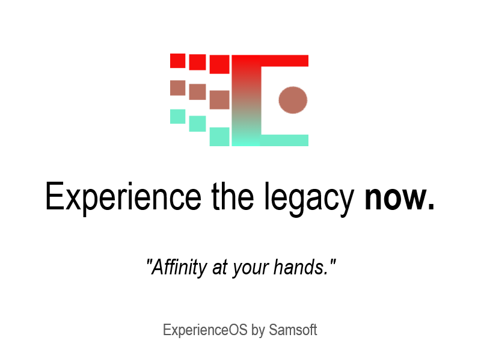

# ExperienceOS

A highly capable simulated operating system with the following *highly advanced* features:

-	**VFS**  
	A fully simulated virtual file system, capable of representing files and directories, directly exportable to your computer.
-	**Window Manager**  
	A complicated window manager with support for movable windows, which are also resizable, minimizable and maximizable.
-	**Component Framework**  
	An advanced but highly usable UI element/component API Framework, capable of expressing the most complex of interfaces.

And much more.

